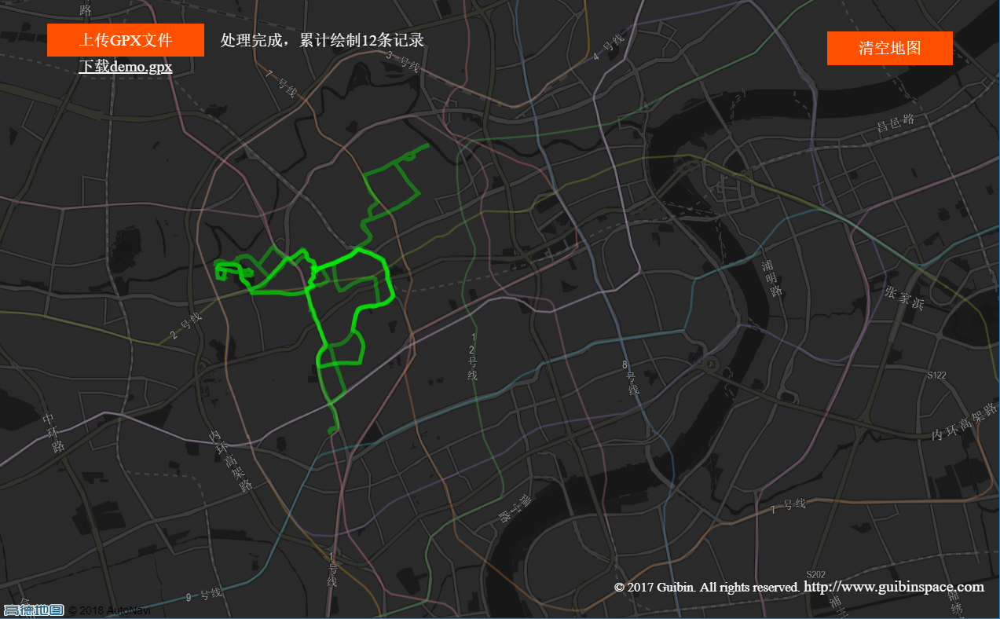

# iRunMap
在各大跑步设备和平台中将跑步记录以GPX形式导出后，上传绘制在同一张地图内,看看跑过了哪些地方。

采用了高德地图提供的SDK。

# Demo
[查看Demo](http://gbcdef.github.io/iRunMap)

# History
2018-08-12
* 使用vue重构，原来使用gulp作为构建工具的jquery版本保存到raw-js-with-gulp分支下